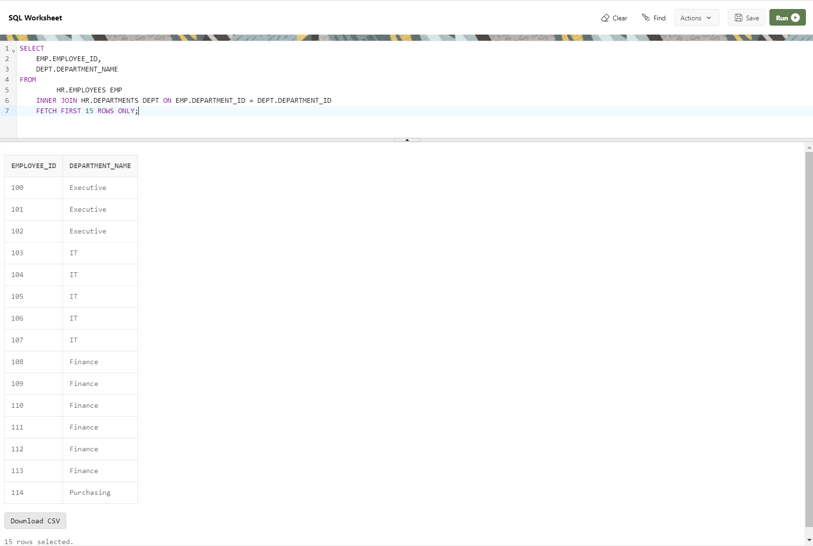
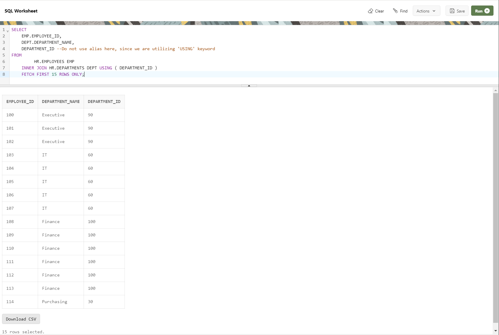

--------------------------------------------------------------------------------
An inner join only returns results that match in both tables. Your SELECT query can use INNER JOIN keyword instead of the JOIN keyword
so, following queries, will return the exact same result.

Example:
--------------------------------------------------------------------------------
Utilizing JOIN Keyword
--------------------------------------------------------------------------------
    SELECT
        EMP.EMPLOYEE_ID,
        DEPT.DEPARTMENT_NAME
    FROM
            HR.EMPLOYEES EMP
        JOIN HR.DEPARTMENTS DEPT ON EMP.DEPARTMENT_ID = DEPT.DEPARTMENT_ID
        FETCH FIRST 15 ROWS ONLY;

--------------------------------------------------------------------------------

--------------------------------------------------------------------------------
Utilizing INNER JOIN Keyword
--------------------------------------------------------------------------------
    SELECT
        EMP.EMPLOYEE_ID,
        DEPT.DEPARTMENT_NAME
    FROM
            HR.EMPLOYEES EMP
        INNER JOIN HR.DEPARTMENTS DEPT ON EMP.DEPARTMENT_ID = DEPT.DEPARTMENT_ID
        FETCH FIRST 15 ROWS ONLY;

--------------------------------------------------------------------------------

--------------------------------------------------------------------------------
Utilizing INNER JOIN Keyword along with USING keyword
--------------------------------------------------------------------------------
    SELECT
        EMP.EMPLOYEE_ID,
        DEPT.DEPARTMENT_NAME,
        DEPARTMENT_ID --Do not use alias here, since we are utilizing 'USING' keyword
    FROM
            HR.EMPLOYEES EMP
        INNER JOIN HR.DEPARTMENTS DEPT USING ( DEPARTMENT_ID )
        FETCH FIRST 15 ROWS ONLY;

--------------------------------------------------------------------------------

