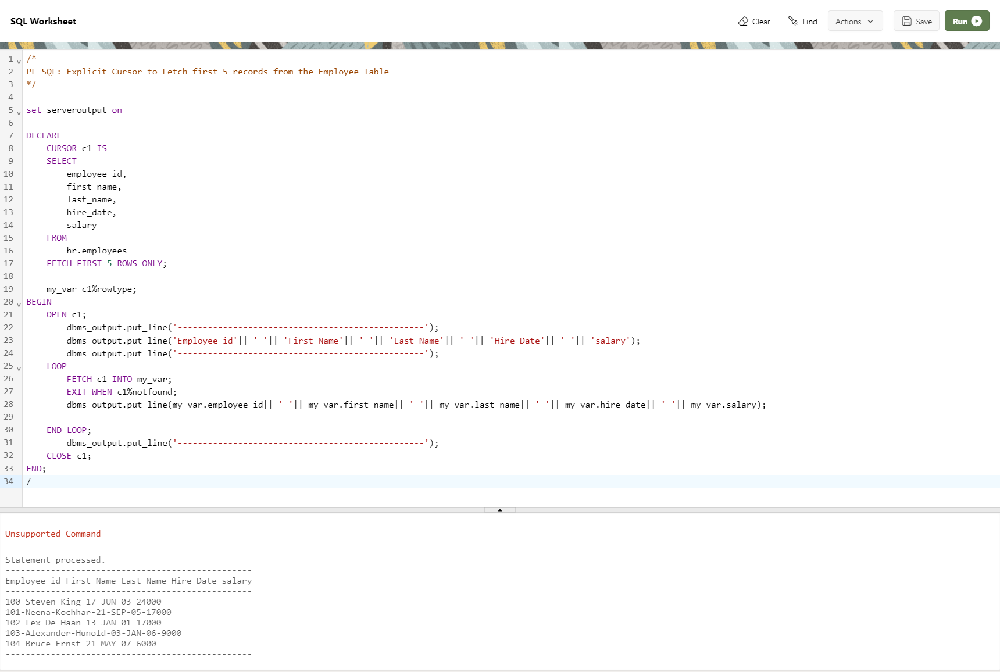

--------------------------------------------------------------------------------
PL-SQL: Explicit Cursor to Fetch first 5 records from the Employee Table
--------------------------------------------------------------------------------

    set serveroutput on

    DECLARE
        CURSOR c1 IS
        SELECT
            employee_id,
            first_name,
            last_name,
            hire_date,
            salary
        FROM
            hr.employees
        FETCH FIRST 5 ROWS ONLY;

        my_var c1%rowtype;
    BEGIN
        OPEN c1;
            dbms_output.put_line('-------------------------------------------------');
            dbms_output.put_line('Employee_id'|| '-'|| 'First-Name'|| '-'|| 'Last-Name'|| '-'|| 'Hire-Date'|| '-'|| 'salary');
            dbms_output.put_line('-------------------------------------------------');
        LOOP
            FETCH c1 INTO my_var;
            EXIT WHEN c1%notfound;
            dbms_output.put_line(my_var.employee_id|| '-'|| my_var.first_name|| '-'|| my_var.last_name|| '-'|| my_var.hire_date|| '-'|| my_var.salary);

        END LOOP;
            dbms_output.put_line('-------------------------------------------------');
        CLOSE c1;
    END;
    /

--------------------------------------------------------------------------------

