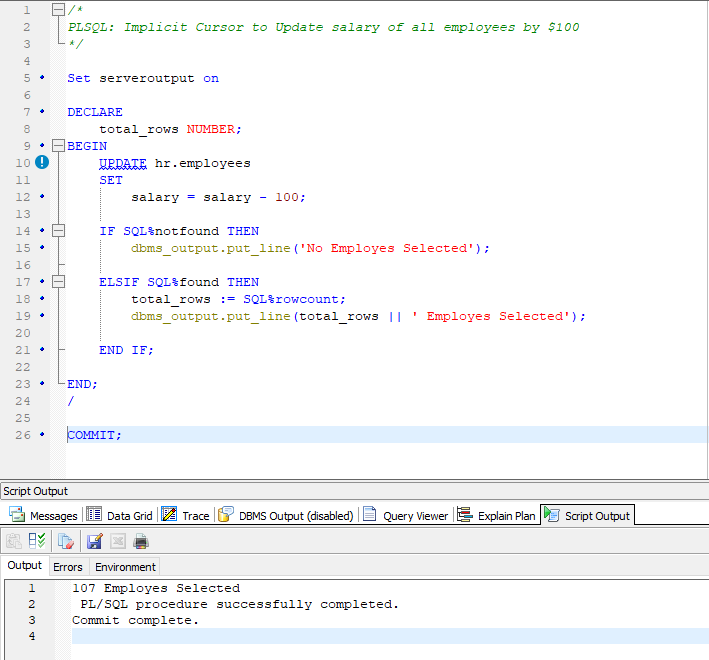

--------------------------------------------------------------------------------
PLSQL: Implicit Cursor to Update salary of all employees by $100
--------------------------------------------------------------------------------

    Set serveroutput on

    DECLARE
        total_rows NUMBER;
    BEGIN
        UPDATE hr.employees
        SET
            salary = salary - 100;

        IF SQL%notfound THEN
            dbms_output.put_line('No Employes Selected');

        ELSIF SQL%found THEN
            total_rows := SQL%rowcount;
            dbms_output.put_line(total_rows || ' Employes Selected');

        END IF;

    END;
    /

    COMMIT;

--------------------------------------------------------------------------------

