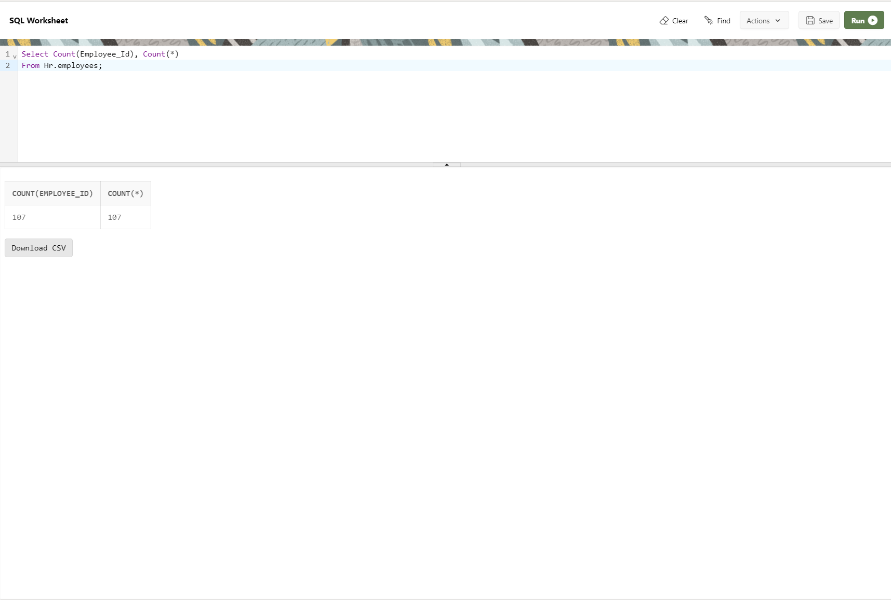

--------------------------------------------------------------------------------
Count-Records-in-2-columns-at-the-same-time
--------------------------------------------------------------------------------

Note:
--------------------------------------------------------------------------------
    one is count(*), another is count(specific_column_name)
    count(*) - Will run against any column which has least number of null-values
    count(specific_column_name) - Will run against only that specific column
--------------------------------------------------------------------------------
    Select Count(Employee_Id), Count(*)
    From Hr.employees;

--------------------------------------------------------------------------------

