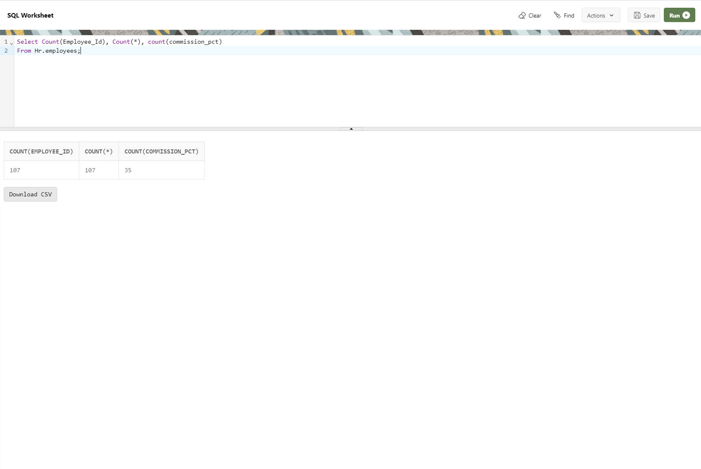

--------------------------------------------------------------------------------
Count-Records-in-3-columns-at-the-same-time-with-null-values
--------------------------------------------------------------------------------

Note:
--------------------------------------------------------------------------------
    one is count(specific_column_name), another is  count(*), and then again 

    count(specific_column_name) - Will run against only that specific column
    count(*) - Will run against any column which has least number of null-values
    count(specific_column_name) [with null values] : Will only count not-null values

--------------------------------------------------------------------------------

    Select Count(Employee_Id), Count(*), count(commission_pct)
    From Hr.employees;

--------------------------------------------------------------------------------

