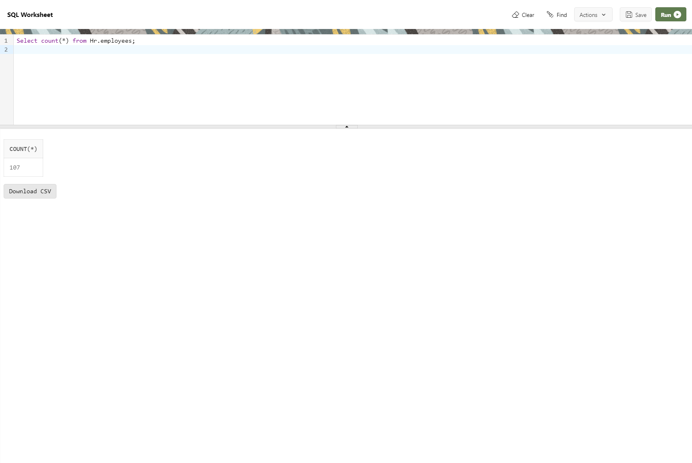

--------------------------------------------------------------------------------
Count: Records in a table (any column)
--------------------------------------------------------------------------------

    Select count(*) from Hr.employees;

--------------------------------------------------------------------------------

