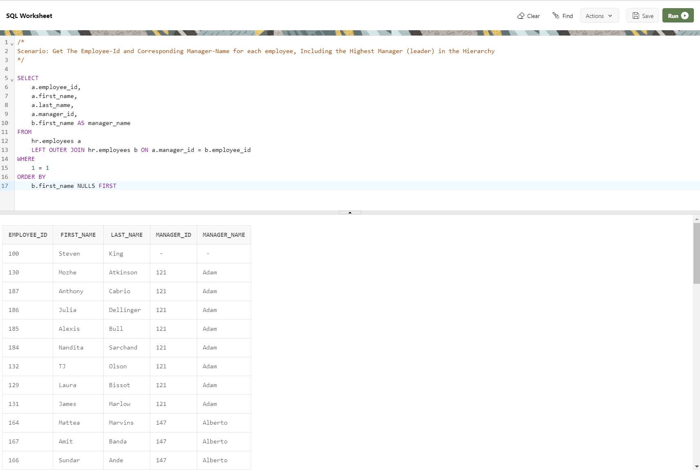

--------------------------------------------------------------------------------
Scenario: Get The Employee-Id and Corresponding Manager-Name for each employee, Including the Highest Manager (leader) in the Hierarchy 
--------------------------------------------------------------------------------

    SELECT
        a.employee_id,
        a.first_name,
        a.last_name,
        a.manager_id,
        b.first_name AS manager_name
    FROM
        hr.employees a
        LEFT OUTER JOIN hr.employees b ON a.manager_id = b.employee_id
    WHERE
        1 = 1
    ORDER BY
        b.first_name NULLS FIRST

--------------------------------------------------------------------------------
