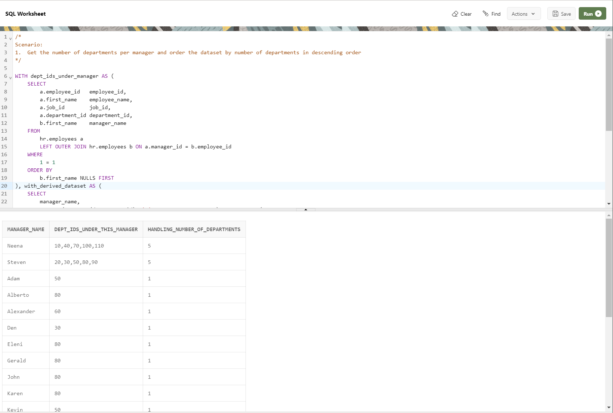

--------------------------------------------------------------------------------
Scenario: Get the number of departments per manager and order the dataset by number of departments in descending order
--------------------------------------------------------------------------------

    WITH dept_ids_under_manager AS (
        SELECT
            a.employee_id   employee_id,
            a.first_name    employee_name,
            a.job_id        job_id,
            a.department_id department_id,
            b.first_name    manager_name
        FROM
            hr.employees a
            LEFT OUTER JOIN hr.employees b ON a.manager_id = b.employee_id
        WHERE
            1 = 1
        ORDER BY
            b.first_name NULLS FIRST
    ), with_derived_dataset AS (
        SELECT
            manager_name,
            LISTAGG(DISTINCT(department_id), ',' ON OVERFLOW TRUNCATE) WITHIN GROUP(
            ORDER BY
                department_id
            ) AS dept_ids_under_this_manager
        FROM
            dept_ids_under_manager
        GROUP BY
            manager_name
    )
    SELECT
        manager_name,
        dept_ids_under_this_manager,
        ( regexp_count(dept_ids_under_this_manager, ',') + 1 ) AS handling_number_of_departments
    FROM
        with_derived_dataset
    ORDER BY
        3 DESC;

--------------------------------------------------------------------------------
