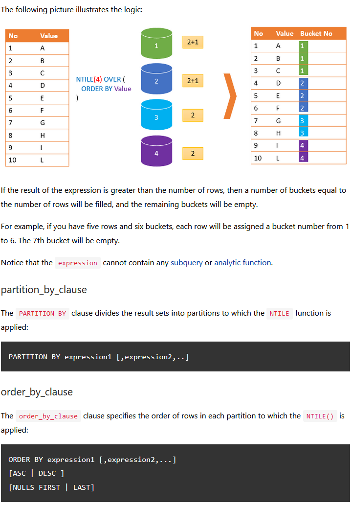
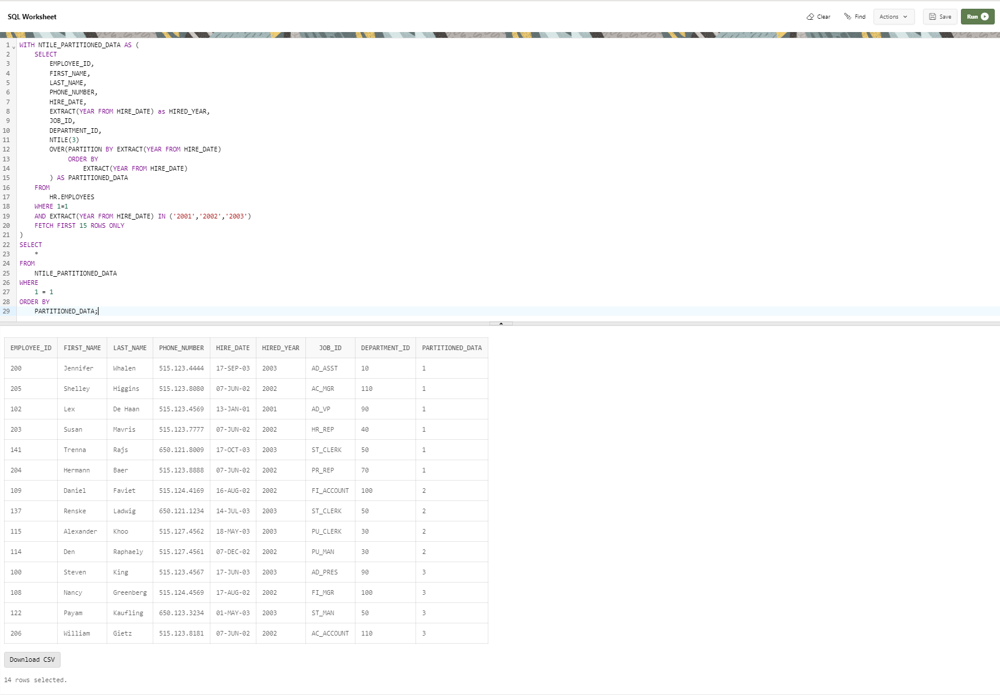

--------------------------------------------------------------------------------
NTILE-Explanation-and-Usage-Example
--------------------------------------------------------------------------------

Explanation:
--------------------------------------------------------------------------------
    Oracle NTILE() function is an analytical function that divides an ordered result set into a number of and assigns an 
    appropriate bucket number to each row.
    
    The expression is any valid expression evaluated to a positive integer.

    The buck number is from 1 to the result of expression e.g., N. The number of rows in buckets can differ by at most 1. 
    The remainder of the number of rows divided by buckets is allocated to each bucket, starting from the first bucket.

    Suppose you have a result set that consists of 10 rows and you want to divide this result set into 4 buckets. 
    
    First, 4 buckets will 2 rows are created. 
    The remainder is 2 (10/4). These 2 buckets will be distributed to first and second buckets. 
    As the result, the first and second buckets will have 2 + 1 = 3 rows. 
    The last two buckets will have 2 rows.

--------------------------------------------------------------------------------

--------------------------------------------------------------------------------

    WITH NTILE_PARTITIONED_DATA AS (
        SELECT
            EMPLOYEE_ID,
            FIRST_NAME,
            LAST_NAME,
            PHONE_NUMBER,
            HIRE_DATE,
            EXTRACT(YEAR FROM HIRE_DATE) as HIRED_YEAR,
            JOB_ID,
            DEPARTMENT_ID,
            NTILE(3)
            OVER(PARTITION BY EXTRACT(YEAR FROM HIRE_DATE)
                ORDER BY
                    EXTRACT(YEAR FROM HIRE_DATE)
            ) AS PARTITIONED_DATA
        FROM
            HR.EMPLOYEES
        WHERE 1=1
        AND EXTRACT(YEAR FROM HIRE_DATE) IN ('2001','2002','2003')
        FETCH FIRST 15 ROWS ONLY
    )
    SELECT
        *
    FROM
        NTILE_PARTITIONED_DATA
    WHERE
        1 = 1
    ORDER BY
        PARTITIONED_DATA;

--------------------------------------------------------------------------------

