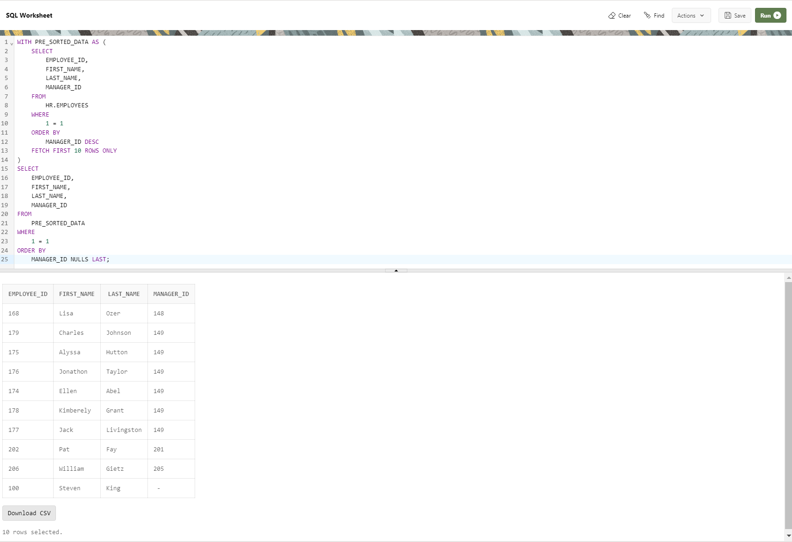

--------------------------------------------------------------------------------
order-by-nulls-first
--------------------------------------------------------------------------------

    WITH PRE_SORTED_DATA AS (
        SELECT
            EMPLOYEE_ID,
            FIRST_NAME,
            LAST_NAME,
            MANAGER_ID
        FROM
            HR.EMPLOYEES
        WHERE
            1 = 1
        ORDER BY
            MANAGER_ID DESC
        FETCH FIRST 10 ROWS ONLY
    )
    SELECT
        EMPLOYEE_ID,
        FIRST_NAME,
        LAST_NAME,
        MANAGER_ID
    FROM
        PRE_SORTED_DATA
    WHERE
        1 = 1
    ORDER BY
        MANAGER_ID NULLS LAST;

--------------------------------------------------------------------------------        

