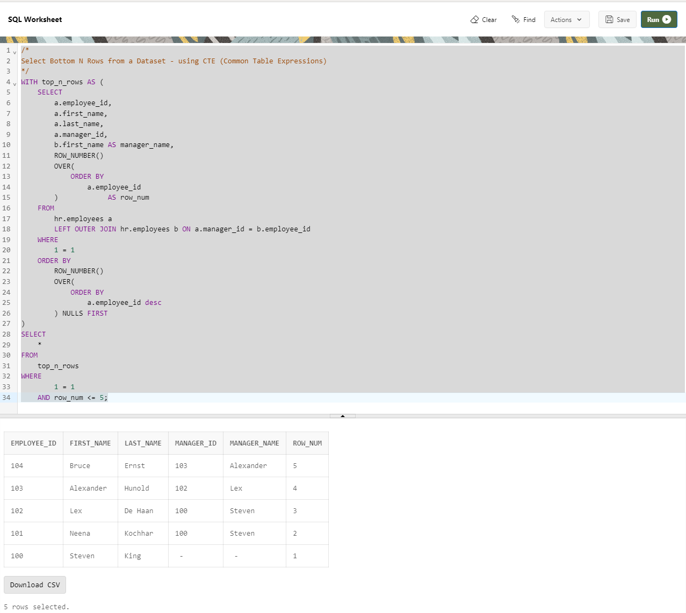

--------------------------------------------------------------------------------
Select Bottom N Rows from a Dataset - using CTE (Common Table Expressions)
--------------------------------------------------------------------------------
    WITH top_n_rows AS (
        SELECT
            a.employee_id,
            a.first_name,
            a.last_name,
            a.manager_id,
            b.first_name AS manager_name,
            ROW_NUMBER()
            OVER(
                ORDER BY
                    a.employee_id
            )            AS row_num
        FROM
            hr.employees a
            LEFT OUTER JOIN hr.employees b ON a.manager_id = b.employee_id
        WHERE
            1 = 1
        ORDER BY
            ROW_NUMBER()
            OVER(
                ORDER BY
                    a.employee_id desc
            ) NULLS FIRST
    )
    SELECT
        *
    FROM
        top_n_rows
    WHERE
            1 = 1
        AND row_num <= 5;

--------------------------------------------------------------------------------

